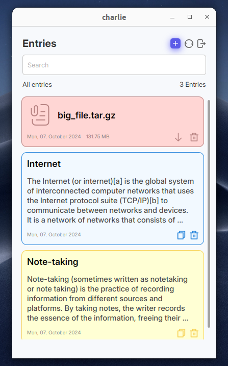

# charlie-fx

charlie-fx is the desktop client for the charlie note-taking project.
charlie is a self-hosted note-taking and file sharing application. 
With charlie your notes will be stored on your device, backed up to
your server instance and distributed to your other devices.

⚠️ This project is still under development, expect possible breaking changes.




## Features
- Offline first note-taking
- Live updates of your notes without reloading
- Supports searching in your shared notes and files
- Sync notes between devices using charlie-server
- Share files between devices
- Notes are stored in an explicit folder as txt files

A main goal is for the entries to be encrypted, but that is still
in development and as of this writing they are not being encrypted.

## How it works
charlie-fx uses JavaFx to create a cross-platform desktop client. Syncing of 
entries (notes and files) was implemented by hand and only uses Websockets and basic HTTP-requests.
To sync entries a device transmits its changes to the collection of notes to the server. The server
manages all logged in devices and distributes the changes received by one device to all other 
devices. A change is either an addition of a note or a removal of a note. This mechanism is based 
on CRDTs. See https://inria.hal.science/hal-00932836/file/CRDTs_SSS-2011.pdf and https://arxiv.org/pdf/1806.10254 (Sets like LWW).

## Usage
You can either build charlie-fx from source or download a prebuilt version from the releases page.
Currently only a prebuilt release for linux is available, as this is the only platform I have
access to and can build for myself.

### Build
This project was built using jdk version 17.0.2. An installation
of that is therefore necessary to build this project.

To run with maven on linux/macOS use:
```bash
$ ./mvnw javafx:run
```

To generate an executable binary for linux:
```bash
$ ./mvnw -DoutputDirectory=./_build/dependencies dependency:copy-dependencies
$ ./mvnw clean package
$ jpackage --module-path _build:_build/dependencies \
           --module com.tenzens.charliefx/com.tenzens.charliefx.MainApplication \
           --add-modules org.xerial.sqlitejdbc \
           --dest charlie-fx-build \
           --name charlie-fx \
           --type app-image
```

You also need to have a charlie-server instance running. See the charlie-server repo for 
information on that.

## Missing features
- Encryption of entries
- Currently, every device acts as a replica; should be worked on if a web version is planned

## Improvements
- All entries are loaded from disk to memory, performance intensive operation if the number of entries is very large
- The switching of views is done pretty inefficiently and should be improved
- The way the entries are stored using sqlite could be improved

## Credits
This project makes use of many different images and icons as well as third party libraries. 
Their creators and licenses are specified in the NOTICE file.

## Motivation behind this project
I had already worked on a project like
this in a group project in my second semester of computer science but failed at effectively synchronizing notes between devices. I always wondered how you could
accomplish the synchronization part and had some time on hand to do some more research and figure it
out. This project is a however a total overhaul of the group project and I rebuilt it from the ground up.